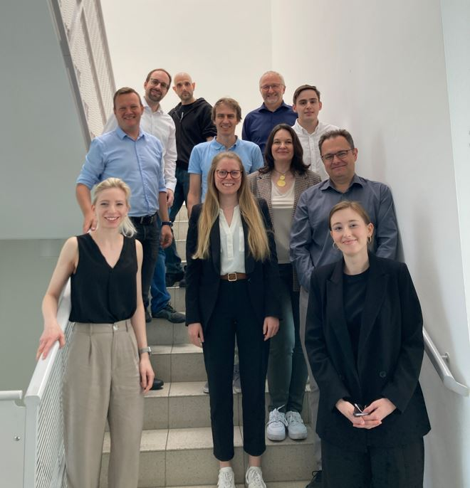
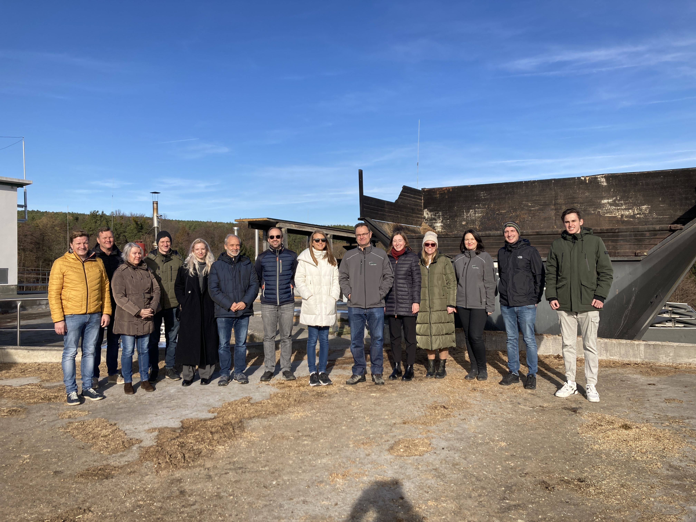

Das Projekt _transpAIrent.energy - Transparent AI Forecasts for Green Energy in Austria_ zielt darauf ab, mithilfe von generative artificial intelligence (AI)-Methoden probabilistische Live-Prognosen für energiesystemrelevante Größen wie Strompreise und CO2-Intensitäten in Österreich zu erstellen und eine transparente Plattform zu entwickeln, die diese öffentlich zugänglich macht.

<!--more-->

Diese Prognosen werden im Zuge des Projekts weiters dazu verwendet, eine Optimierungsstrategie für den Betrieb flexibler erneuerbarer Energieanlagen unter vielfältigen umwelt- und systemrelevanten Anforderungen zu entwickeln. Durch diese „Mehrziel"-Optimierungsstrategie werden gleichzeitig ein betriebswirtschaftlicher Nutzen, welcher Anreize erzeugt und eine niedrigere CO2-Intensität garantiert und so der Übergang zu einem umweltfreundlicheren Energiesystem gefördert.

## Factsheet

|   |   |
|---|---|
| **Kurzform** | <mark>transpAIrent.energy</mark> |
| **Titel** | transpAIrent.energy - Transparent AI Forecasts for Green Energy in Austria |
| **Laufzeit** | 01.05.2024 -- 30.04.2027 |
| **Partner** | 4 |
| **Projektform** | Kofinanziertes Forschungsprojekt |
| **Projektleitung** | [Klara Maggauer](mailto:klara.maggauer@ait.ac.at) & [Stefan Strömer](mailto:stefan.stroemer@ait.ac.at) |

## Haupterkenntnisse

Eine Zusammenfassung der im Projekt erarbeiteten Haupterkenntnisse wird nach Projektabschluss hier veröffentlicht.

## Überblick

### Projektziele

Im Rahmen des Projekts werden im Speziellen folgende Ziele verfolgt:

1. Entwicklung eines innovativen generative-AI-basierten Algorithmus zur Erstellung probabilistischer Prognosen für energiesystemrelevante Größen und deren Live-Veröffentlichung auf einer transparenten Plattform
2. Nutzung dieser Prognosen zur Optimierung flexibler erneuerbarer Energieanlagen, um deren Betrieb sowohl wirtschaftlicher als auch nachhaltiger zu gestalten

### Projektpartner

- [AIT Austrian Institute of Technology GmbH](https://www.ait.ac.at/ueber-das-ait/center/center-for-energy) (Projektkoordinator)
- [B-SEC better secure GmbH & Co KG](https://www.b-sec.net/)
- [Projektplanungs- Beratungs- und Entwicklungs GmbH](https://www.pbeg.at/)
- [UBIMET GmbH](https://www.ubimet.com/)

### Förderhinweis

Dieses Projekt wird im Rahmen der Ausschreibung 2023 von "AI for Green" des Bundesministeriums für Klimaschutz, Umwelt, Energie, Mobilität, Innovation und Technologie (BMK) durchgeführt. Die Abwicklung erfolgt im Auftrag des BMK durch die Österreichische Forschungsförderungsgesellschaft (FFG).
Mehr Informationen finden sich in der [FFG Projektdatenbank](https://projekte.ffg.at/projekt/5121370).

## Arbeitspakete & Deliverables

Die Projektziele werden mithilfe von sechs dedizierten Arbeitspaketen innerhalb des Projekts erreicht, die auf Folgendes abzielen:



<!-- =============================================================================================================== -->

<u>Aufgaben</u> 
<ul>
  <li>Projektmanagement und Koordination des Projektteams</li>
  <li>Überwachung von Fortschritt, Kosten, Qualität und Termintreue</li>
  <li>Durchführung von Berichterstattung, Ressourcenplanung und Kommunikation</li>
  <li>Erstellung eines umfassenden Abschlussberichts und eines veröffentlichbaren Berichts</li>
</ul>

<u>Deliverables</u> 
<mark>D1.1</mark> <a href="deliverables/d1_1">Interim report 1</a> 
<mark>D1.2</mark> <a href="deliverables/d1_2">Interim report 2</a> 
<mark>D1.3</mark> <a href="deliverables/d1_3">Final report</a> 
<mark>D1.4</mark> <a href="deliverables/d1_4">Publishable report</a> 

<!-- =============================================================================================================== -->

<u>Aufgaben</u> 
<ul>
  <li>Design und Implementierung einer Datenverarbeitungspipeline, einschließlich einer Datenbank</li>
  <li>Automatisierte Datensammlung & Bereinigung von Fehlern; "Auffüllen" von fehlenden Daten (durch generative AI)</li>
  <li>Berechnung von CO2-Intensitäten im Strommix</li>
  <li>Entwicklung von Wetterparametervorhersagen mithilfe von AI-Methoden (<u>Lead: UBIMET</u>)</li>
</ul>

<u>Deliverables</u> 
<mark>D2.1</mark> <a href="deliverables/d2_1">Documentation of data validation</a> 
<mark>D2.2</mark> <a href="deliverables/d2_2">Publication of algorithmic methodologies and complete data pipeline</a> 

<!-- =============================================================================================================== -->

<u>Aufgaben</u> 
<ul>
  <li>Review, Implementierung und Validierung von generative AI-Prognosealgorithmen</li>
  <li>Schwerpunkt auf transformer-based architectures, generative adverserial networks (GANs) und Diffusionsmodellen</li>
  <li>Anwendung der AI-Algorithmen auf Zeitreihenprognosen in Energiesystemen und Bewertung ihrer Performance anhand eines Benchmarks, der auf Standardfehlermessungen und KPIs aus umfangreichen Backtests basiert</li>
</ul>

<u>Deliverables</u> 
<mark>D3.1</mark> <a href="deliverables/d3_1">Algorithm review and implementation documentation</a> 
<mark>D3.2</mark> <a href="deliverables/d3_2">Algorithm validation result documentation</a> 

<!-- =============================================================================================================== -->

<u>Aufgaben</u> 
<ul>
  <li>Design der "transpAIrent.energy" Plattformarchitektur</li>
  <li>Spezifikation funktionaler Anforderungen und User Stories für die Plattform und Software</li>
  <li>Implementierung von Softwarekomponenten durch Wiederverwendung von Komponenten aus der bestehenden Anwendung, basierend auf aktuellen State-of-the-Art-Frameworks und Plattformen</li>
  <li>Aufbau und Betrieb der Plattform auf einer cloudbasierten Infrastruktur</li>
</ul>

<u>Deliverables</u> 
<mark>D4.1</mark> <a href="deliverables/d4_1">Application requirements and use case specification</a> 
<mark>D4.2</mark> <a href="deliverables/d4_2">Application software development report</a> 
<mark>D4.3</mark> <a href="deliverables/d4_3">Application usage statistics report</a> 

<!-- =============================================================================================================== -->

<u>Aufgaben</u> 
<ul>
  <li>Stochastische Optimierung basierend auf den probabilistischen generative AI-Prognosen aus Arbeitspaket 3</li>
  <li>Entwicklung eines digitalen Zwillings der Teststandorte mithilfe eines Simulationsmodells</li>
  <li>Simulative und experimentelle Live-Tests an drei Teststandorten</li>
</ul>

<u>Deliverables</u> 
<mark>D5.1</mark> <a href="deliverables/d5_1">Digital twin optimization result documentation</a> 
<mark>D5.2</mark> <a href="deliverables/d5_2">Live test site optimization result documentation</a> 

<!-- =============================================================================================================== -->

<u>Aufgaben</u> 
<ul>
  <li>Entwicklung von Strategien zur Vervielfachung der Nutzung der transpAIrent.energy-Plattform, um die Sichtbarkeit des Projekts zu erhöhen und seine Wirkung zu vergrößern</li>
  <li>Einbindung von Stakeholdern, um Benutzerfreundlichkeit und Anwendbarkeit der Plattform und der entwickelten Ansätze sicherzustellen</li>
  <li>Steigerung der wissenschaftlichen Exzellenz sowie Stärkung von Kooperation, Vernetzung und Technologietransfer</li>
</ul>

<u>Deliverables</u> 
<mark>D6.1</mark> <a href="deliverables/d6_1">Exploitation roadmap</a> 
<mark>D6.2</mark> <a href="deliverables/d6_2">Documentation of two public dissemination activities</a> 
<mark>D6.3</mark> <a href="deliverables/d6_3">Two scientific publications</a> 
<mark>D6.4</mark> <a href="deliverables/d6_4">Stakeholder workshop documentation</a> 

<!-- =============================================================================================================== -->



## Einblicke



<!-- =============================================================================================================== -->


<!-- =============================================================================================================== -->

Kickoff-Meeting mit dem Projektteam am AIT in Wien

  


<!-- =============================================================================================================== -->

Konsortialmeeting und Besichtigung der Biogasanlage Bleier in Weingraben im Burgenland

  


<!-- =============================================================================================================== -->

<ul>
  <li><u>Titel</u>: Probabilistische Vorhersagen relevanter Energiesystemvariablen mittels Generative AI</li>
  <li><u>Autor:innen</u>: <mark>Verena Alton</mark>, Peter Widhalm, Stefan Strömer, Lukas Exl</li>
  <li><u>Präsentation</u>: <a href="assets/94_presentation_20250318_160623.pdf" target="_blank">PDF</a></li>
</ul>

<!-- =============================================================================================================== -->

