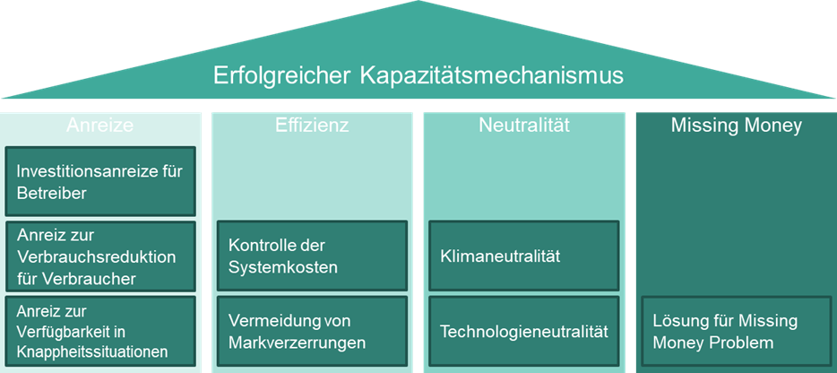

Was macht einen Kapazitätsmechanismus erfolgreich?
Damit Strom auch in Zukunft sicher und bezahlbar bleibt, braucht es geeignete Anreize und Strukturen im Energiesystem. Kapazitätsmechanismen spielen dabei eine zentrale Rolle. Sie helfen, systemische Knappheiten zu adressieren – sei es durch fehlende Erzeugungskapazität zu Spitzenzeiten oder durch einen Mangel an verfügbarer Energie über längere Zeiträume. Welche Aspekte dabei entscheidend sind, zeigt dieser Beitrag.
<!-- more -->

Um den geeignetsten Mechanismus festzulegen, ist es entscheidend zu verstehen, welche Art von Knappheit im Energiesystem auftreten kann. Grundsätzlich gibt es zwei Typen von Engpässen: Kapazitäts- und Energieengpässe.
In kapazitätsbeschränkten Systemen entsteht Knappheit, wenn die installierte Leistung (MW) nicht ausreicht, um die Nachfrage zu bestimmten Spitzenzeiten abzudecken. Ursachen hierfür können der plötzliche Ausfall von thermischen Kraftwerken oder geringe Windleistung sein. Obwohl insgesamt über den Tag verteilt genügend Energie verfügbar wäre, fehlt es in diesen kritischen Momenten an ausreichender installierter Kapazität.
In energiebegrenzten Systemen ist es genau umgekehrt: Hier entsteht Knappheit, weil nicht genug Energie zur Verfügung steht. Zwar könnte die Spitzenlast bedient werden, jedoch reicht die verfügbare Energie nicht aus, um die Nachfrage über längere Zeiträume hinweg (z. B. Stunden oder Wochen) vollständig zu decken.
Ein kapazitätsbeschränktes System sollte daher die Fähigkeit der Akteure honorieren, kurzfristig Leistung bereitzustellen, um Spitzenlasten auszugleichen. Ein energiebegrenztes System hingegen sollte Anreize setzen, Ressourcen langfristig so zu bewirtschaften, dass sie insbesondere in Zeiten knapper Energie (z. B. in trockenen Jahren) verfügbar bleiben.

## Übersicht der Aspekte eines erfolgreichen Kapazitätsmechanismus:

### 1. Anreize

- **Investitionsanreize für Betreiber:**  
  Ein wirksamer Kapazitätsmechanismus (KM) muss sicherstellen, dass Energieerzeuger ausreichende Anreize erhalten, in neue Kapazitäten zu investieren. Dies ist entscheidend, um Versorgungssicherheit bei hoher Nachfrage oder beim Ausfall bestehender Anlagen zu gewährleisten. Der Mechanismus sollte langfristige Investitionen in moderne und effiziente Kraftwerke fördern, um die Stabilität des Stromnetzes zu sichern.

- **Anreize zur Verbrauchsreduktion für Verbraucher:**  
  Neben den Erzeugern sollten auch Verbraucher motiviert werden, ihren Stromverbrauch bei hoher Netzbelastung zu reduzieren. Dies kann durch dynamische Preisgestaltung oder Programme zur Laststeuerung geschehen. Solche Anreize unterstützen die Netzstabilität und verringern den Bedarf an zusätzlichen Erzeugungskapazitäten.

- **Anreize zur Verfügbarkeit in Knappheitssituationen:**  
  Als Gegenleistung für Investitionsförderungen wird von teilnehmenden Kapazitätsanbietern erwartet, ihre geförderte Kapazität in Phasen von Systemstress tatsächlich am Markt anzubieten. Dies erfolgt entweder über Verpflichtungen oder finanzielle Anreize.

### 2. Effizienz

- **Kontrolle der Systemkosten:**  
  Ein effektiver KM muss die Systemkosten im Blick behalten und darf diese nicht unkontrolliert ansteigen lassen, um wirtschaftliche Belastungen zu vermeiden. Ein Beispiel dafür ist die Situation in der Ukraine, wo trotz Vermeidung eines Blackouts extrem hohe Preise auftraten. Der KM sollte Versorgungssicherheit sicherstellen, ohne Endverbraucher erheblich zu belasten.

- **Vermeidung von Marktverzerrungen:**  
  Der KM sollte bestehende Energiemärkte nicht verzerren. Idealerweise fügt er sich nahtlos in die vorhandenen Marktstrukturen ein, um den Wettbewerb und die Effizienz des gesamten Marktes zu erhalten.

### 3. Klima- und Technologieneutralität

Ein KM muss klima- und technologieneutral ausgestaltet sein. Er sollte keine spezifischen Technologien bevorzugen oder benachteiligen, aber gleichzeitig emissionsarme oder emissionsfreie Technologien zur Teilnahme motivieren.

### 4. Lösung für das „Missing Money“-Problem

Ein KM muss eine Lösung für das sogenannte „Missing Money“-Problem bieten, indem er zusätzliche Einnahmequellen schafft oder Anreize setzt, die sicherstellen, dass Erzeuger trotz volatiler Marktbedingungen angemessen vergütet werden.