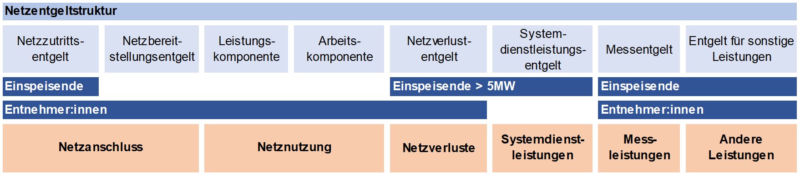

Die Kosten für Betrieb und Wartung des Stromnetzes werden vom [Netzbetreiber](./wissen/akteure/index.md) durch das sogenannte Systemnutzungsentgelt gedeckt, das von allen angeschlossenen Nutzer:innen entrichtet wird. Es variiert je nach genutzter [Spannungsebene](./wissen/stromnetz/index.md) und wird von der österreichischen [Regulierungsbehörde](./wissen/akteure/index.md) E-Control per Verordnung festgelegt.[^1]

Das Systemnutzungsentgelt fällt sowohl für die Entnahme von Strom als auch für die Einspeisung ins Netz an. Während Haushalte und Unternehmen für den Netzanschluss und die Stromabnahme zahlen, entrichten auch Erzeuger, beispielsweise Betreiber von Photovoltaikanlagen, ein Entgelt für die Einspeisung ihrer Energie.[^2]

### Zusammensetzung des Systemnutzungsentgelts

Das Systemnutzungsentgelt setzt sich aus sieben verschiedenen Kostenkomponenten zusammen:

- Netznutzungsentgelt, aufgeteilt in eine Arbeits- und Leistungskomponente
- Netzverlustentgelt
- Entgelt für Messleistungen
- Netzbereitstellungsentgelt
- Systemdienstleistungsentgelt
- Netzzutrittsentgelt
- Entgelt für sonstige Leistungen

Folgende Grafik bietet einen Überblick über die Struktur des Systemnutzungsentgelts in Österreich und zeigt die einzelnen Kostenkomponenten für Einspeisende und Entnehmer:innen. [^2]

*Abb. 1: Überblick über die Komponenten des Systemnutzungsentgelts © E-Control [^2]*

Im Rahmen von [Energiegemeinschaften](./wissen/energiegemeinschaften/index.md) können bestimmte Kostenkomponenten reduziert werden.

## Weitere Informationen

- Detaillierte Informationen zu den einzelnen Kostenkomponenten: [E-Control: Systemnutzungsentgelte](https://www.e-control.at/industrie/strom/strompreis/systemnutzungsentgelte)
- Rechtsvorschrift und Höhe der Entgelte: [Systemnutzungsentgelte-Verordnung, Fassung vom 10.02.2025](https://www.ris.bka.gv.at/GeltendeFassung.wxe?Abfrage=Bundesnormen&Gesetzesnummer=20010107)

[^1] [APG: Österreichisches Strommarktmodell](https://markt.apg.at/strommarkt/oesterreichisches-strommarktmodell/)
[^2] [E-Control: Systemnutzungsentgelte](https://www.e-control.at/industrie/strom/strompreis/systemnutzungsentgelte)
