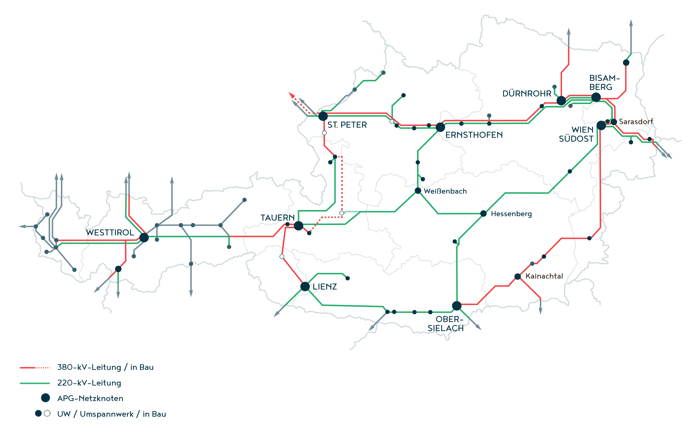

Das österreichische Stromnetz bildet die Grundlage für den Transport elektrischer Energie von Kraftwerken zu Endverbraucher:innen. Es besteht aus sieben Netzebenen, die sich durch ihre Funktionen und Spannungsniveaus unterscheiden und durch Übertragungs- und Verteilnetzbetreiber organisiert werden. Dieser Artikel gibt einen Überblick über die verschiedenen Netzebenen und ihre jeweilige Rollen im Stromnetz.

<!-- more -->

## Das Stromnetz

Das österreichische Stromnetz bildet die grundlegende Infrastruktur für die Übertragung elektrischer Energie. Es leitet den in Kraftwerken erzeugten Strom zu Umspannwerken, von wo aus er weiterverteilt und schließlich den Endverbraucher:innen bereitgestellt wird. Die Organisation des Netzes erfolgt je nach Netzebene durch [Übertragungs- bzw. Verteilnetzbetreiber](/wissen/akteure/).

Das österreichische Stromnetz ist in sieben Netzebenen unterteilt, die sich durch ihr jeweiliges Spannungsniveau unterscheiden. Dabei gibt es vier [Spannungsebenen](#spannungsebenen) (Netzebenen 1, 3, 5 und 7) sowie drei [Umspannungsebenen](#umspannungsebenen) (Netzebenen 2, 4 und 6), die den Übergang zwischen den Spannungsstufen ermöglichen.[^1] [^2] Die folgende Grafik zeigt das vom Übertragungsnetzbetreiber <abbr title="Austrian Power Grid">APG</abbr> betriebene Höchstspannungsnetz.[^3]

*Abb. 1: Das österreichische Höchst- und Hochspannungsnetz © 2024 Austrian Power Grid AG [^3]*

### Spannungsebenen

#### Höchstspannungsebene (Netzebene 1)

Die Höchstspannungsebene umfasst Leitungen mit Spannungen von 220 kV und 380 kV. Diese ermöglichen einen verlustarmen Transport großer Energiemengen über weite Distanzen und ermöglicht den international Stromaustausch. Großkraftwerke, wie große Wasserkraftwerke, speisen ihre erzeugte Energie in dieser Netzebene ein.[^1]

#### Hochspannungsebene (Netzebene 3)

In der Hochspannungsebene wird Strom mit einer Spannung von 110 kV transportiert. Sie dient der ersten großflächigen Verteilung zur Versorgung von Städten und großen Industrieanlagen. Mittelgroße Kraftwerke speisen hier ein, darunter der Großteil der erneuerbaren Energieanlagen.[^2] [^4]

#### Mittelspannungsebene (Netzebene 5)

Die Mittelspannungsebene wird mit Spannungen von 1 kV bis 36 kV betrieben und versorgt einzelne Stadtteile und Ortschaften. Hier speisen auch kleinere, städtische Kraftwerke ein.[^2] [^3]

#### Niederspannungsebene (Netzebene 7)

Haushalte sowie kleinere Gewerbebetriebe erhalten ihren Strom über Netzebene 7, die mit 400 bis 230 V betrieben wird. Kleine PV-Anlagen und andere dezentrale Erzeuger speisen hier ein.[^1] [^2]

### Umspannungsebenen

Die Umspannungsebenen sorgen dafür, dass die Spannung mit Hilfe von Umspannwerken von einer höheren auf eine niedrigere Netzebene herabgesetzt wird. Dabei verbindet Netzebene 2 die Höchst- mit der Hochspannungsebene, während Netzebene 4 den Übergang von Hoch- zu Mittelspannung bildet. In Netzebene 6 erfolgt schließlich die Transformation von Mittel- auf Niederspannung, sodass der Strom für Haushalte und Betriebe nutzbar wird.[^2] [^3]

[^1]: [E-Control: Das Stromnetz](https://www.e-control.at/konsumenten/das-stromnetz)
[^2]: [Wien Energie: Das österreichische Stromnetz](https://positionen.wienenergie.at/wissenshub/einfach-erklaert/rund-um-die-energiewende/oesterreichisches-stromnetz/)
[^3]: [APG: Stromnetz Österreich](https://www.apg.at/stromnetz/stromnetz-oesterreich/)
[^4]: [Verbund: Wie funktioniert das Stromnetz?](https://www.verbund.com/de-at/privatkunden/themenwelten/strom-aus-wasserkraft/stromnetz)
